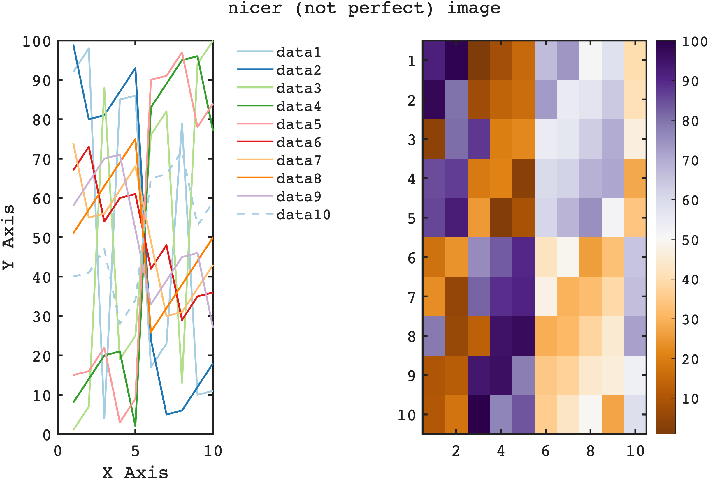

# Improving Default aesthetics for Matlab

Author: G. Nike Gnanateja

I wrote this just to improve the deault aesthetic scheme in matlab. 
This is not designed to replace the whole publication quality aestics. 
But this will help format the initial asthetics so that they don't suckkkkk!


## How to use

Just place the startup.m file in the default matlab path to set default aesthetics forever. 

Or

Just add the startup.m file to your working directory, and run it before plotting the main figures. 

here is an example
```matlab
 figure;
 subplot(1,2,1)
 plot(magic(10));
 xlabel('X Axis')
 ylabel('Y Axis')
 sgtitle('nicer (not perfect) image')
 legend(); 
 subplot(1,2,2)
 imagesc(magic(10))
 shading interp
 colorbar
```

 

